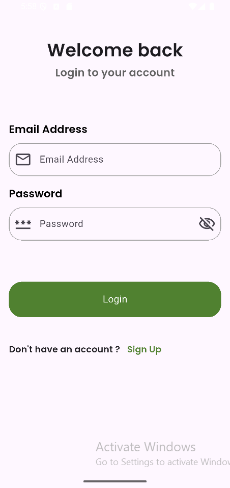
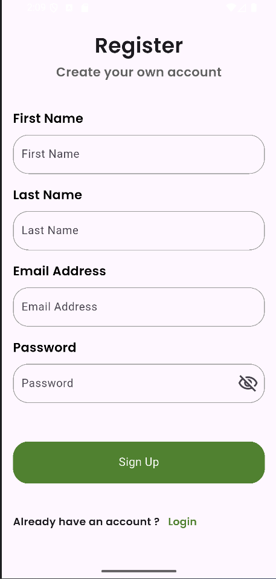
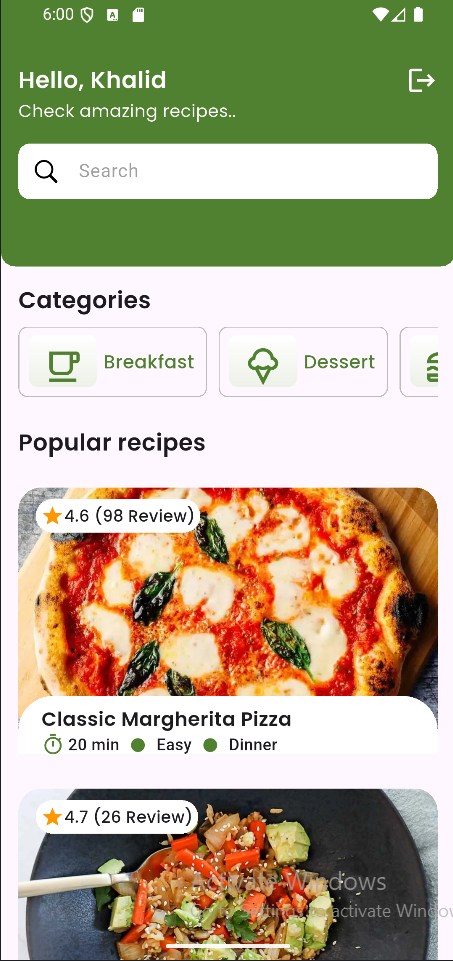
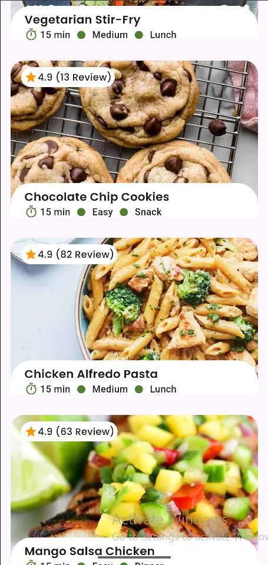
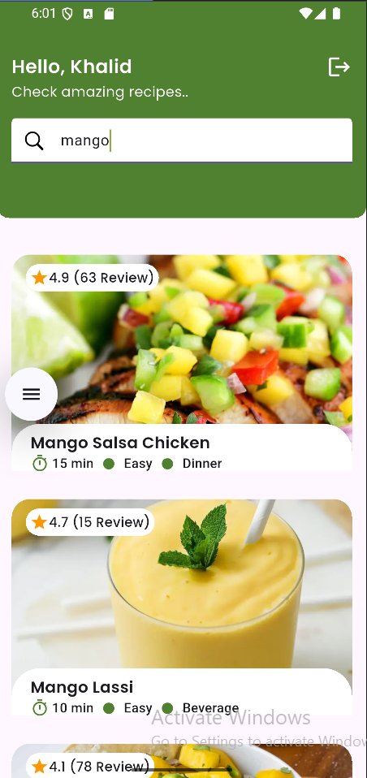
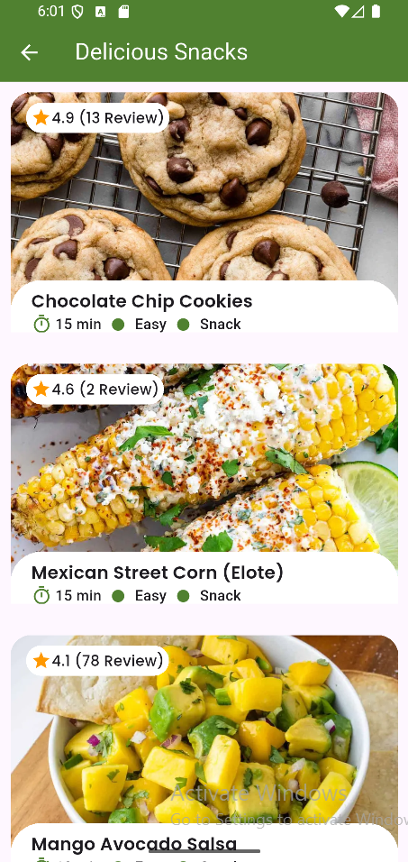
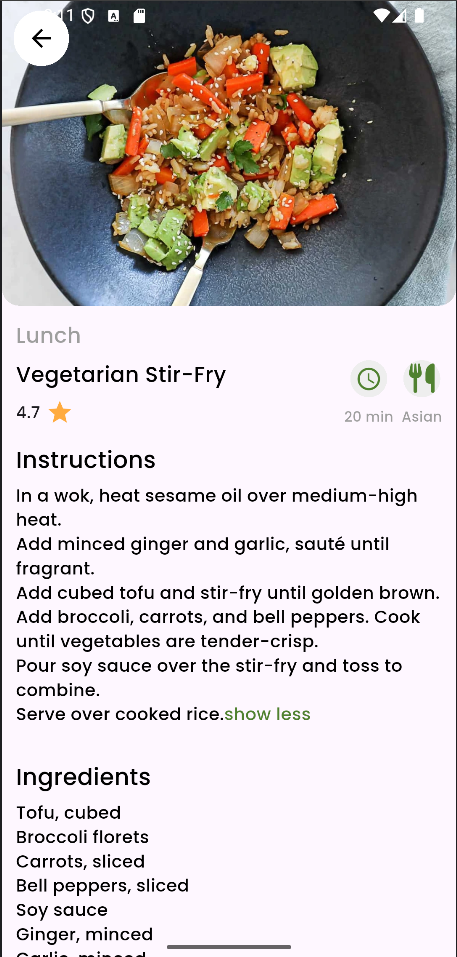

# Flavor-Fi

Flavor-Fi is a Flutter recipes application built using Firebase, REST APIs, and custom widgets.

## ✨ Features

* **Branded Splash Screen:** A clean and professional entry point to the application.
* **User Authentication:** Secure Login and Sign-up system powered by Firebase Auth.
* **Personalized Dashboard:** A welcoming home screen that displays the user's name and personalized content.
* **Categorized Recipes:** Browse meals easily by categories like Breakfast, Lunch, Desserts, and Snacks.
* **Popular Recipes Section:** Highlights top-rated recipes with their ratings, preparation time, and difficulty level.
* **Detailed Recipe View:** Comprehensive details for each recipe, including full ingredients and step-by-step cooking instructions.
* **Dynamic Search:** A real-time search bar that allows users to find specific recipes instantly by name.
* **Session Management:** Secure logout functionality to protect user data.

## 🛠 Built With

* **Framework:** Flutter.
* **Backend:** Firebase (Auth & Firestore).
* **Communication:** REST APIs.
* **Architecture:** Clean Folder Structure (Models, Services, Widgets).

## 📸 Screenshots

| | | | |
| :-: | :-: | :-: | :-: |
|  |  |  |  |
|  |  |  |  |

